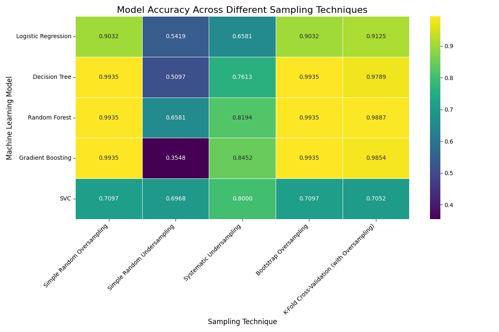

# Assignment-Sampling

##  Project Objective
The objective of this project is to handle an imbalanced classification dataset by converting it into a balanced dataset using different sampling techniques and analyzing their impact on various machine learning models.

The experiment compares multiple sampling strategies to determine which technique provides the best accuracy for each model and overall performance.

---

##  Dataset
The dataset used is a Credit Card Fraud Detection dataset containing highly imbalanced classes:

- Class 0 → Normal Transactions
- Class 1 → Fraud Transactions

A stratified train-test split is used to ensure fair evaluation.

---

##  Sampling Techniques Implemented
The following sampling techniques were applied to balance the dataset:

1. Random Oversampling
2. Random Undersampling
3. Systematic Sampling
4. Bootstrap Sampling
5. K-Fold Sampling (with Oversampling)

---

##  Machine Learning Models Used
Five classification models were trained and evaluated:

- Logistic Regression
- Decision Tree
- Random Forest
- Gradient Boosting
- Support Vector Classifier (SVC)

---

##  Accuracy Comparison

| Model | Random Oversampling | Random Undersampling | Systematic Sampling | Bootstrap Sampling | K-Fold Sampling |
|------|------|------|------|------|------|
| Logistic Regression | 90.32 | 54.19 | 65.81 | 90.32 | 91.25 |
| Decision Tree | 99.35 | 50.97 | 76.13 | 99.35 | 97.89 |
| Random Forest | 99.35 | 65.81 | 81.94 | 99.35 | 98.87 |
| Gradient Boosting | 99.35 | 35.48 | 84.52 | 99.35 | 98.54 |
| SVC | 70.97 | 69.68 | 80.00 | 70.97 | 70.52 |

---

##  Observations
- Random Oversampling consistently achieved the highest accuracy across most models.
- Bootstrap Sampling produced almost identical performance to Random Oversampling.
- Random Undersampling performed worst due to loss of important majority-class data.
- Tree-based models (Decision Tree, Random Forest, Gradient Boosting) outperformed linear models.
- SVC showed comparatively moderate performance.

---

##  Best Performing Combination
- **Best Sampling Technique:** Random Oversampling
- **Best Models:** Decision Tree, Random Forest, Gradient Boosting
- **Highest Accuracy:** 99.35%

---

##  Visualization
A heatmap was generated to visualize model performance across sampling techniques.

The heatmap shows that Random Oversampling and Bootstrap Sampling consistently achieve higher accuracy across most machine learning models.

---

## Technologies Used
- Python
- Pandas
- NumPy
- Scikit-learn
- Matplotlib
- Seaborn

---

##  Conclusion
Balancing an imbalanced dataset significantly improves classification accuracy. Random Oversampling proved to be the most effective technique because it preserves all original data while increasing minority samples. Ensemble models handled the balanced dataset better than linear models.

